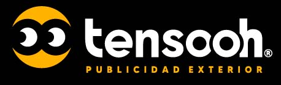

# 🎯 Tensooh Media - Sitio Web Corporativo

<p align="center">
    
</p>

<p align="center">
    <strong>Publicidad Out of Home (OOH) - Más que una empresa, somos una familia</strong>
</p>

<p align="center">
    <a href="https://laravel.com" target="_blank">
        
    </a>
    <a href="https://www.php.net" target="_blank">
        
    </a>
    <a href="https://getbootstrap.com" target="_blank">
        
    </a>
</p>

## 📋 Descripción del Proyecto

**Tensooh Media** es una empresa ecuatoriana especializada en publicidad exterior (Out of Home) con más de 15 años de experiencia en el mercado nacional. Este sitio web corporativo presenta sus servicios, trabajos realizados y permite el contacto directo con clientes potenciales.

### 🏢 Sobre la Empresa
- **Experiencia**: 15 años en el mercado
- **Especialidad**: Publicidad OOH (Out of Home)
- **Servicios**: Diseño creativo, logística, impresión y metal mecánica
- **Filosofía**: "Somos más que una empresa, somos una familia"

## ✨ Características Principales

### 🎨 Frontend
- **Diseño Responsivo**: Compatible con dispositivos móviles y desktop
- **Animaciones**: Headlines animados y efectos visuales atractivos
- **Galería de Clientes**: Showcase de partners y clientes destacados
- **Integración Social**: Enlaces directos a WhatsApp e Instagram
- **SEO Optimizado**: Meta tags y Open Graph configurados

### 🔧 Backend
- **Framework**: Laravel 8.x
- **Arquitectura**: MVC (Model-View-Controller)
- **Base de Datos**: MySQL
- **Sistema de Correo**: PHPMailer integrado
- **Autenticación**: Laravel Auth (preparado para futuras funcionalidades)

### 📱 Funcionalidades
- **Página de Inicio**: Presentación de la empresa y servicios
- **Sección Trabajos**: Portfolio de proyectos realizados
- **Formulario de Contacto**: Sistema de envío de correos automático
- **Integración WhatsApp**: Contacto directo via WhatsApp Business
- **Redes Sociales**: Enlaces a Instagram corporativo

## 🛠️ Tecnologías Utilizadas

### Backend
- **Laravel Framework**: 8.65
- **PHP**: 7.3+ | 8.0+
- **Artesaos SEOTools**: 0.20.2 (Optimización SEO)
- **PHPMailer**: 6.5 (Sistema de correos)
- **Laravel Sanctum**: 2.11 (API Authentication)
- **Laravel UI**: 3.3 (Scaffolding de autenticación)

### Frontend
- **Bootstrap**: 4.x (Framework CSS)
- **jQuery**: 1.12.4
- **Slick Carousel**: Para sliders y carruseles
- **FontAwesome**: Iconografía
- **Themify Icons**: Iconos adicionales
- **Animate.css**: Animaciones CSS

### Herramientas de Desarrollo
- **Laravel Mix**: 6.0.6 (Asset compilation)
- **Axios**: 0.21 (HTTP client)
- **Lodash**: 4.17.19 (Utilidades JavaScript)
- **PostCSS**: 8.1.14 (CSS processing)

## 📁 Estructura del Proyecto

```
Tensooh-publicidad/
├── app/
│   ├── Http/Controllers/
│   │   └── HomeController.php          # Controlador principal
│   ├── Mail/
│   │   └── ContactoMaileble.php        # Clase para envío de correos
│   └── Models/
│       ├── ContactUs.php               # Modelo de contactos
│       └── User.php                    # Modelo de usuarios
├── database/
│   └── migrations/
│       └── create_contact_us_table.php # Migración tabla contactos
├── public/
│   ├── css/                           # Estilos CSS
│   ├── js/                            # Scripts JavaScript
│   ├── img/                           # Imágenes y assets
│   └── fonts/                         # Fuentes tipográficas
├── resources/
│   └── views/
│       ├── layouts/
│       │   └── plantilla.blade.php    # Layout principal
│       ├── welcome.blade.php          # Página de inicio
│       ├── aboutus.blade.php          # Página de trabajos
│       ├── contacto.blade.php         # Página de contacto
│       └── mail/
│           └── mailcontacto.blade.php # Template de correo
└── routes/
    └── web.php                        # Rutas web
```

## 🚀 Instalación y Configuración

### Prerrequisitos
- PHP 7.3 o superior
- Composer
- MySQL/MariaDB
- Node.js y NPM (para assets)
- Servidor web (Apache/Nginx)

### Pasos de Instalación

1. **Clonar el repositorio**
```bash
git clone [URL_DEL_REPOSITORIO]
cd Tensooh-publicidad
```

2. **Instalar dependencias de PHP**
```bash
composer install
```

3. **Instalar dependencias de Node.js**
```bash
npm install
```

4. **Configurar variables de entorno**
```bash
cp "env example" .env
```

5. **Configurar base de datos en `.env`**
```env
DB_CONNECTION=mysql
DB_HOST=127.0.0.1
DB_PORT=3306
DB_DATABASE=tensooh
DB_USERNAME=root
DB_PASSWORD=
```

6. **Generar clave de aplicación**
```bash
php artisan key:generate
```

7. **Ejecutar migraciones**
```bash
php artisan migrate
```

8. **Compilar assets**
```bash
npm run dev
# o para producción
npm run production
```

9. **Iniciar servidor de desarrollo**
```bash
php artisan serve
```

## 📧 Configuración de Correo

El sistema utiliza SMTP para el envío de correos. Configurar en `.env`:

```env
MAIL_MAILER=smtp
MAIL_HOST=mail.tensooh.com
MAIL_PORT=465
MAIL_USERNAME=webtensooh@tensooh.com
MAIL_PASSWORD=tu_password_aqui
MAIL_ENCRYPTION=SSL
MAIL_FROM_ADDRESS=webtensooh@tensooh.com
MAIL_FROM_NAME="Contacto Tensooh Web"
```

## 🗄️ Base de Datos

### Tabla `contact_us`
Almacena los mensajes de contacto enviados desde el formulario web:

| Campo     | Tipo      | Descripción                    |
|-----------|-----------|--------------------------------|
| id        | int       | ID único autoincremental       |
| name      | string    | Nombre completo del contacto   |
| telephone | string    | Número de teléfono             |
| email     | string    | Correo electrónico             |
| empresa   | string    | Nombre de la empresa           |
| message   | text      | Mensaje del contacto           |
| timestamps| timestamp | Fechas de creación/actualización|

## 🌐 Rutas Principales

| Ruta        | Método | Controlador           | Descripción              |
|-------------|--------|-----------------------|--------------------------|
| `/`         | GET    | HomeController@index  | Página de inicio         |
| `/trabajos` | GET    | HomeController@about  | Página de trabajos       |
| `/contacto` | GET    | HomeController@contact| Formulario de contacto   |
| `/contacto` | POST   | HomeController@mensaje| Procesar envío de mensaje|

## 🎨 Personalización

### Colores Corporativos
- **Primario**: #FFA73B (Naranja Tensooh)
- **Secundario**: #656667 (Gris)
- **Fondo**: #f4f4f4 (Gris claro)

### Logos y Branding
- Logo principal: `public/img/logo/logotensooh.jpg`
- Favicon: `public/favicon.ico`
- Imágenes de partners: `public/img/parnners/`

## 📱 Integraciones Sociales

### WhatsApp Business
- **Enlace**: https://api.whatsapp.com/message/FHJO6CYULYN2P1
- **Ubicación**: Botón flotante y header

### Instagram
- **Perfil**: @tensooh.ec
- **Enlace**: https://www.instagram.com/tensooh.ec/

## 🔒 Seguridad

- **CSRF Protection**: Habilitado en formularios
- **Validación de datos**: Implementada en controladores
- **Sanitización**: Datos de entrada filtrados
- **Headers de seguridad**: Configurados en servidor web

## 📈 SEO y Performance

### Optimizaciones SEO
- **Meta tags**: Título, descripción y keywords
- **Open Graph**: Para redes sociales
- **Twitter Cards**: Configuradas
- **Canonical URLs**: Implementadas
- **Sitemap**: Generado automáticamente

### Performance
- **Asset minification**: CSS y JS minificados
- **Image optimization**: Imágenes optimizadas
- **Caching**: Sistema de caché de Laravel
- **CDN Ready**: Preparado para CDN

## 🚀 Despliegue en Producción

### Configuraciones Recomendadas

1. **Servidor Web**
```apache
# .htaccess ya configurado para Apache
# Para Nginx, configurar virtual host apropiado
```

2. **Variables de Entorno**
```env
APP_ENV=production
APP_DEBUG=false
APP_URL=https://tensooh.com
```

3. **Optimizaciones**
```bash
php artisan config:cache
php artisan route:cache
php artisan view:cache
composer install --optimize-autoloader --no-dev
```

## 🤝 Contribución

Para contribuir al proyecto:

1. Fork el repositorio
2. Crear una rama para tu feature (`git checkout -b feature/AmazingFeature`)
3. Commit tus cambios (`git commit -m 'Add some AmazingFeature'`)
4. Push a la rama (`git push origin feature/AmazingFeature`)
5. Abrir un Pull Request

## 📞 Contacto y Soporte

### Información de la Empresa
- **Teléfono**: (06) 2313021
- **Móvil**: +593 985453983
- **Email**: info@tensooh.com
- **Sitio Web**: https://tensooh.com

### Desarrollo Técnico
- **Desarrollado por**: JinoxWeb
- **Sitio del desarrollador**: http://jinox.rf.gd/

## 📄 Licencia

Este proyecto está bajo la Licencia MIT. Ver el archivo `LICENSE` para más detalles.

## 🙏 Agradecimientos

- **Laravel Framework** por la excelente base de desarrollo
- **Bootstrap** por el framework CSS
- **FontAwesome** por los iconos
- **Todos los clientes** que han confiado en Tensooh Media durante estos 15 años

---

<p align="center">
    <strong>Desarrollado con ❤️ para Tensooh Media</strong><br>
    <em>"Somos más que una empresa, somos una familia"</em>
</p>

<p align="center">
<a href="https://travis-ci.org/laravel/framework"></a>
<a href="https://packagist.org/packages/laravel/framework"></a>
<a href="https://packagist.org/packages/laravel/framework"></a>
<a href="https://packagist.org/packages/laravel/framework"></a>
</p>

## Landing Page Tensooh Publicidad (Laravel 8 - PHP 8.1)

Laravel is a web application framework with expressive, elegant syntax. We believe development must be an enjoyable and creative experience to be truly fulfilling. Laravel takes the pain out of development by easing common tasks used in many web projects, such as:

- [Simple, fast routing engine](https://laravel.com/docs/routing).
- [Powerful dependency injection container](https://laravel.com/docs/container).
- Multiple back-ends for [session](https://laravel.com/docs/session) and [cache](https://laravel.com/docs/cache) storage.
- Expressive, intuitive [database ORM](https://laravel.com/docs/eloquent).
- Database agnostic [schema migrations](https://laravel.com/docs/migrations).
- [Robust background job processing](https://laravel.com/docs/queues).
- [Real-time event broadcasting](https://laravel.com/docs/broadcasting).

Laravel is accessible, powerful, and provides tools required for large, robust applications.

## Learning Laravel

Laravel has the most extensive and thorough [documentation](https://laravel.com/docs) and video tutorial library of all modern web application frameworks, making it a breeze to get started with the framework.

If you don't feel like reading, [Laracasts](https://laracasts.com) can help. Laracasts contains over 1500 video tutorials on a range of topics including Laravel, modern PHP, unit testing, and JavaScript. Boost your skills by digging into our comprehensive video library.

## Laravel Sponsors

We would like to extend our thanks to the following sponsors for funding Laravel development. If you are interested in becoming a sponsor, please visit the Laravel [Patreon page](https://patreon.com/taylorotwell).

### Premium Partners

- **[Vehikl](https://vehikl.com/)**
- **[Tighten Co.](https://tighten.co)**
- **[Kirschbaum Development Group](https://kirschbaumdevelopment.com)**
- **[64 Robots](https://64robots.com)**
- **[Cubet Techno Labs](https://cubettech.com)**
- **[Cyber-Duck](https://cyber-duck.co.uk)**
- **[Many](https://www.many.co.uk)**
- **[Webdock, Fast VPS Hosting](https://www.webdock.io/en)**
- **[DevSquad](https://devsquad.com)**
- **[Curotec](https://www.curotec.com/services/technologies/laravel/)**
- **[OP.GG](https://op.gg)**
- **[CMS Max](https://www.cmsmax.com/)**
- **[WebReinvent](https://webreinvent.com/?utm_source=laravel&utm_medium=github&utm_campaign=patreon-sponsors)**
- **[Lendio](https://lendio.com)**

## Contributing

Thank you for considering contributing to the Laravel framework! The contribution guide can be found in the [Laravel documentation](https://laravel.com/docs/contributions).

## Code of Conduct

In order to ensure that the Laravel community is welcoming to all, please review and abide by the [Code of Conduct](https://laravel.com/docs/contributions#code-of-conduct).

## Security Vulnerabilities

If you discover a security vulnerability within Laravel, please send an e-mail to Taylor Otwell via [taylor@laravel.com](mailto:taylor@laravel.com). All security vulnerabilities will be promptly addressed.

## License

The Laravel framework is open-sourced software licensed under the [MIT license](https://opensource.org/licenses/MIT).
